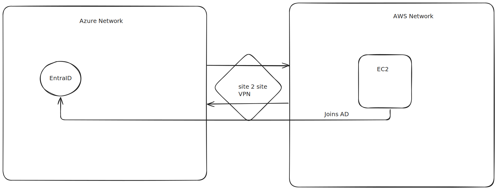

### Site-to-Site VPN Connection Between Azure and AWS

The entered IPv4 address range may not work correctly. It is recommended to use an address range that is not globally routable,
such as 172.16.0.0/12, or a range defined in RFC 1918 and RFC 6598.

What address ranges can I use in my virtual networks? \
We recommend that you use the following address ranges, which are enumerated in RFC 1918.

The IETF has set aside these ranges for private, non-routable address spaces. \
PRIVATE NON ROUTABLE \
10.0.0.0 to 10.255.255.255 (10/8 prefix) \ 
172.16.0.0 to 172.31.255.255 (172.16/12 prefix) \
192.168.0.0 to 192.168.255.255 (192.168/16 prefix)

You can also deploy the shared address space reserved in RFC 6598, which is treated as a private IP address space in Azure: \
100.64.0.0 to 100.127.255.255 (100.64/10 prefix) \
Other address spaces, including all other IETF-recognized private, non-routable address spaces, might work but have undesirable side effects.

In addition, you can't use the following address ranges: \
224.0.0.0/4 (multicast) \
255.255.255.255/32 (broadcast) \
127.0.0.0/8 (loopback) \
169.254.0.0/16 (link local) \
168.63.129.16/32 (internal DNS)

NOTE: Pick IP Ranges that don't overlap between your AWS Network and your Azure Network

## Architecture Diagram:

## Configure Azure
### Step 1: Create a resource group on Azure to deploy the resources.
Create a resource group on Azure to deploy the resources.

Resource Group Name: **entra-domain-services** \
Region: East-US

### Step 2: Create a Virtual Network
Resource Group Name: **entra-domain-services** \
Region: East-US \
VNet Name: **aadds-vnet** \
VNet IPv4 Address Space: _10.0.0.0/22_ \
Subnet Name: **subnet-01** \
Subnet IPv4 Address Space: _10.0.0.0/24_ \
**IPs:** _10.0.0.0 - 10.0.3.255 vnet | 10.0.0.0/22 VNet_

### Step 3: Add a Gateway Subnet
Resource Group Name: entra-domain-services \
Region: East-US \
VNet Name: **aadds-vnet** \
VNet IPv4 Address Space: _10.0.0.0/22_ \
Subnet Name: **aadds-subnet** \
Gateway Subnet: _10.0.1.0/27_

### Step 4: Create the Virtual Network Gateway
Virtual Network Gateway Name: **vng-azure-aws** \
Region: East-US \
Gateway Type: VPN \
SKU: VpnGw1 \
Generation: Generation 1 \
Virtual Network: vnet-azure \
Public IP Address: **pip-vpn-azure-aws** \
Public IP Address Type: Basic \
Assignment: Dynamic \
Enable active-active mode: Disabled \
Configure BGP: Disabled

## Configure AWS
### Step 5: Create the Virtual Private Cloud (VPC) in AWS

Name: **workload-vpc** \
IPv4 CIDR: 172.16.0.0/21

### Step 6: Create a subnet inside the VPC (Virtual Network)

Name: **subnet-01** \
VPC Name: workload-vpc \
VPC IPv4 CIDR: _172.16.0.0/21_

### Step 7: Create a Virtual Customer Gateway pointing to the Public IP Address of Azure VPN Gateway

Name: **cgw-azure-aws** \
BGP ASN: 65515 \
IP Address: [ pip-vpn-azure-aws ] 

IP address: Public IP Address of Azure Virtual Gateway | [ pip-vpn-azure-aws ] \
Rest keep everything as default

Customer Gateway ID: [ cgw-xxxxxxxxxxxxxxxx ]

### Step 8: Create the Virtual Private Gateway, then attach to the VPC

Name: **vpg-azure-aws** \
Virtual Private Gateway: [ vgw-xxxxxxxxxxxxxxxx ] \
Amazon ASN: 64512

### Step 9: Create a site-to-site Virtual Private Gateway Connection
Name: **vpn-aadds-azure-aws** \
Target gateway type: [ vgw-xxxxxxxxxxxxxxxx ] from step 8\
Customer gateway: [ cgw-xxxxxxxxxxxxxxxx ] from step 7\
Routing options: Static \
Static IP prefixes: _10.0.0.0/24_ <--- Azure AADDS CIDR \
_Leave the rest of them as default_

### Step 10: Download the configuration file
Vendor: Generic \
Platform: Generic \
Software: Vendor Agnostic \
In this configuration file you will note that there are the \
Shared Keys and the Public Ip Address for each of one of the two IPSec tunnels created by AWS.

## Connecting Azure and AWS
### Step 11: Create the Local Network Gateway in Azure
Name: **lng-azure-aws-1**
Resource Group Name: entra-domain-services \
Region: East-US \
IP address: [ First Outside IP Virtual Private Gateway address from the configuration file downloaded ] in Step 10. \
Address Space(s): _172.16.0.0/21_ <---- AWS VPC CIDR

### Step 12: Create the connection on the Virtual Network Gateway in Azure
Name: **connection-azure-aws-1**
Connection Type: Site-to-Site \
Local Network Gateway: Select the Local Network Gateway, which you created in Step 11. \
Shared Key: [ First Shared Key from the configuration file downloaded in Step 10. ] \
_Wait till the Connection Status changes to - Connected_ \
In the same way, check in AWS Console whether the first tunnel of Virtual Private Gateway `UP`.

### Step 13: Create the Local Network Gateway in Azure
Name: **lng-azure-aws-2** \
Resource Group Name: entra-domain-services \
Region: East-US \
IP address: [ Second Outside IP Virtual Private Gateway address from the configuration file downloaded in Step 10. ] \
Address Space(s): 172.16.0.0/21 <--- AWS VPC CIDR

### Step 14: Create the connection on the Virtual Network Gateway in Azure
Name: **connection-azure-aws-2**
Connection Type: Site-to-Site \
Local Network Gateway: [ Local Network Gateway created in 3c] \
Shared Key: [ Second Shared Key from the configuration file downloaded in Step 10. ] \
_Wait till the Connection Status changes to - Connected_ \
In the same way, check in AWS Console whether the first tunnel of Virtual Private Gateway UP.

### Step 15: Create Internet Gateway and Attach it to VPC in AWS:
Name: **workload-internet-gateway**

### Step 16: Now let's edit the route table associated with our VPC
Add the route to Azure subnet through the Virtual Private Gateway \
Destination: 10.0.0.0/24 [ Azure AADDS CIDR ] \
Target: Virtual Private Gateway that we created. \
also add, \
Destination: 0.0.0.0/0 \
Target: Internet Gateway that we created in step 15.

#### Step 17: Create VMs in both Azure and AWS and Test the connection.
AWS VM's Private Address: [ 172.16.x.x] \
Azure VM's Private Address: [ 10.0.x.x] \
Azure VM's Public Address: x.x.x.x
